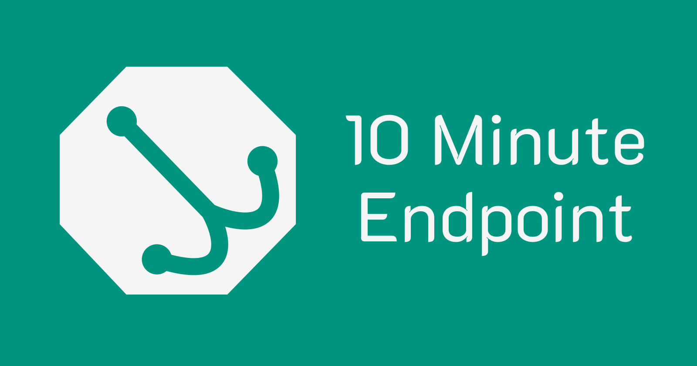

# **10 Minute Endpoint:** Endpoint testing made easy

## Created for the [Linode x Hashnode Hackathon](https://townhall.hashnode.com/build-with-linode-hackathon-june-2022?source=10minuteendpoint_github)


# About

Practice your HTTP requests or test and inspect your webhooks. See the data sent to your servers by third party services!

[**10 Minute Endpoint**](https://10minuteendpoint.net/) is an open-source service that generates a temporary endpoint for a developer to test and inspect HTTP requests sent to it, which can be useful when developing their APIs that may need certain fields of data.

# Features

* Generates endpoints for anonymous users; no signup required.
* Displays logged data to the developer.
* Deletes data as quickly as possible.

# Project Stack

* **Prisma** (MongoDB)
* **Linode** (Ubuntu 20.04)
* **Express** (NodeJS)
* **Bulma** (CSS)

# Prerequisites

### Mongodb

Either install MongoDB locally to your environment, or use one online (through Mongo Atlas for example)

### Prisma

Prisma requires a replica set instead of standalone database.

**Note** - Run `prisma generate` after installing the packages to generate the MongoDB schemas internally.

# Running and Deployment

1. Clone the repo:
```sh
git clone https://github.com/danidre14/10-minute-endpoint-nodejs.git
```

2. Set environment variables for the following (using the `.env` file, for example):
    * NODE_ENV
    * PORT
    * SESSION_SECRET
    * DATABASE_URL
    
Rename the `.env.sample` file to `.env` and use actual credentials obtained in the [Prerequisites](#heading-prerequisites).

3. Install all dependencies:
```sh
cd /path/to/project
npm install
# or yarn install, or other depending on your package manager
```

4. Generate dev dependencies:
```sh
prisma generate
```

5. Run the project:
```sh
npm start
```
Open a browser and hit `http://localhost:5000`
